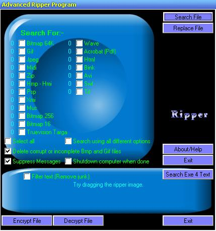



## File Ripper Program \(Extract \.Jpg, \.Mid and more from a File\)

### Description

This program can "Extract" picture, sound and more from any file. Say you like a splash screen in a program, Well this program can try and extract the picture for you. It can also replace picture within files with other picture (Still has some errors though). It Saves all the extracted Files on "C:\" as a default.

Enjoy!!

(Sorry about the lack of remarks in the code, I havn't had time)
 
### More Info
 
The 'Replace File with another' option still has errors!! I managed to patch the Serials 2000 background and adobe splash screen, but other programs did not work as well. In general, you need the same sized file or a smaller file to replace an existing file.

             |
---                |---
**Submitted On**   |2004-05-07 10:14:14
**By**             |[Alex Murray](https://github.com/Planet-Source-Code/PSCIndex/blob/master/ByAuthor/alex-murray.md)
**Level**          |Intermediate
**User Rating**    |4.5 (18 globes from 4 users)
**Compatibility**  |VB 5\.0, VB 6\.0
**Category**       |[Miscellaneous](https://github.com/Planet-Source-Code/PSCIndex/blob/master/ByCategory/miscellaneous__1-1.md)
**World**          |[Visual Basic](https://github.com/Planet-Source-Code/PSCIndex/blob/master/ByWorld/visual-basic.md)
**Archive File**   |[File\_Rippe174260572004\.zip](https://github.com/Planet-Source-Code/alex-murray-file-ripper-program-extract-jpg-mid-and-more-from-a-file__1-53583/archive/master.zip)

